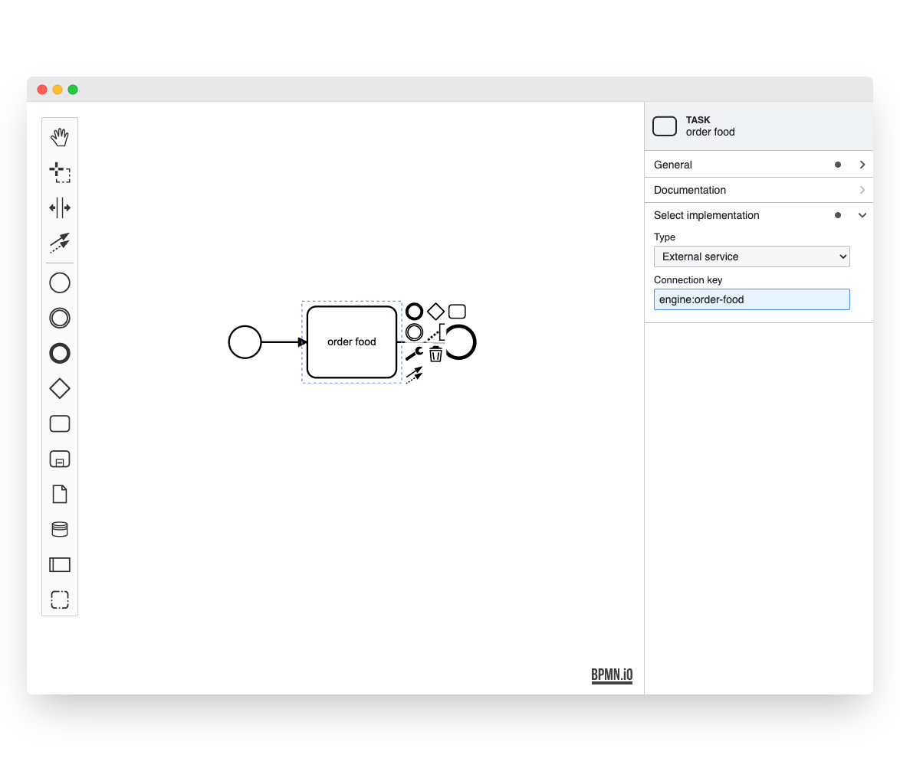

# async-properties-panel-example

This example uses [bpmn-js](https://github.com/bpmn-io/bpmn-js) and [@bpmn-io/bpmn-properties-panel](https://github.com/bpmn-io/bpmn-properties-panel). It implements a BPMN 2.0 modeler that allows you to handle asynchronous data inside a properties panel extension.



## About

This example extends the properties panel to allow editing an `async:implementationDefinition` property on all events and tasks. The available implementation types are fetched from an asynchronous service and displayed in a select component once ready. 

In particular, this example includes

* Adding a group called "Select implementation"
* Adding a "Type" select field to select the implementation type
* Adding a "Connection key" text input field to define a resolvable key
* Displaying the connection key property only if the type is given (conditional rendering)

The properties will be persisted as an extension as part of the BPMN 2.0 document:

```xml
<?xml version="1.0" encoding="UTF-8"?>
<bpmn:definitions ... xmlns:async="http://example.com" id="sample-diagram">
  <bpmn:process id="Process_1">
    <bpmn:startEvent id="StartEvent_1">
      <bpmn:extensionElements>
        <async:implementationDefinition type="external-service" connectionKey="order-food" />
      </bpmn:extensionElements>
    </bpmn:startEvent>
  </bpmn:process>
  ...
</bpmn:definitions>
```

We use basic [preact hooks](https://preactjs.com/guide/v10/hooks) to handle the asynchronous data inside the component.

```js
import {
  useEffect,
  useState
} from 'preact/hooks';

// ...

const EMPTY_OPTION = '';


function Type(props) {
  const { element } = props;

  // ...

  const [ fetchedOptions, setFetchedOptions ] = useState([]);

  // retrieve our available options via async service call
  useEffect(async () => {
    const response = await fetchOptions();
    setFetchedOptions(response);
  }, []);

  // ...

  // display the fetched options in the select component
  const getOptions = (element) => {
    const options = [
      { value: EMPTY_OPTION, label: translate('<none>') }
    ];

    forEach(fetchedOptions, (o) => {
      options.push({ value: o.key, label: translate(o.name) });
    });

    return options;
  };

  return Select({
    element,
    id: 'async-type',
    label: translate('Type'),
    getValue,
    setValue,
    getOptions
  });
}
```

Take a look inside the [properties provider](./src/provider) to gather more details.

To ship our custom extension with the properties panel, we have to wire both the moddle extension and the properties provider when creating the modeler.

```javascript
import BpmnModeler from 'bpmn-js/lib/Modeler';

import {
  BpmnPropertiesPanelModule,
  BpmnPropertiesProviderModule
} from '@bpmn-io/bpmn-properties-panel';

import AsyncPropertiesProviderModule from './provider';

import asyncModdleDescriptors from './descriptors/async.json';


const modeler = new BpmnModeler({
  container: '.diagram-container',
  propertiesPanel: {
    parent: '.properties-container'
  },
  additionalModules: [
    BpmnPropertiesPanelModule,
    BpmnPropertiesProviderModule,
    AsyncPropertiesProviderModule
  ],
  moddleExtensions: {
    async: asyncModdleDescriptors
  }
});
```

## Building the Example

You need a [NodeJS](http://nodejs.org) development stack with [npm](https://npmjs.org) and installed to build the project.

To install all project dependencies execute

```
npm install
```

Build the example using [webpack](https://webpack.js.org/) via

```
npm start
```

You may also spawn a development setup by executing

```
npm run dev
```